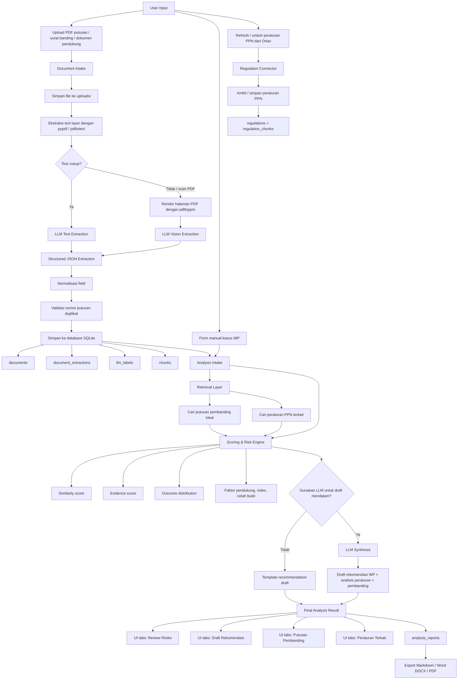
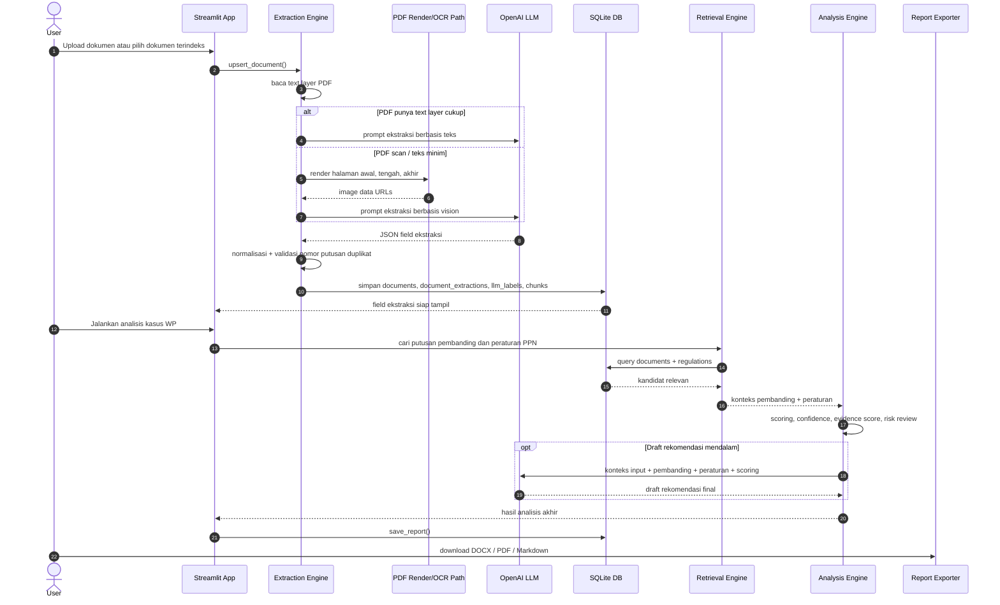

# Diagram Arsitektur LLM Tax Dispute Prototype

Dokumen ini menggambarkan alur LLM dari input dokumen/perkara sampai analisis akhir, rekomendasi WP, dan export dokumen.

## Flow Utama

## Sequence LLM

## Komponen LLM

| Tahap | Fungsi LLM | Input utama | Output |
|---|---|---|---|
| Ekstraksi teks | Membaca putusan yang punya text layer | Potongan header, pokok sengketa, posisi WP/DJP, pertimbangan, amar | JSON ekstraksi terstruktur |
| Ekstraksi vision | Membaca PDF scan | Gambar halaman awal, tengah, akhir | JSON ekstraksi terstruktur |
| Labeling | Klasifikasi pajak, isu, outcome, pihak, nilai sengketa | Teks/gambar dokumen | Metadata + ringkasan analitis |
| Rekomendasi | Menyusun rekomendasi untuk WP | Input kasus, putusan pembanding, peraturan PPN, scoring | Draft rekomendasi mendalam |
| Chat peraturan | Menjawab pertanyaan aturan | Query user + hasil pencarian aturan | Jawaban aturan + lokasi/sumber aturan |

## Data yang Disimpan

| Tabel | Peran |
|---|---|
| `documents` | Metadata dokumen, text layer, status ekstraksi, hasil utama |
| `document_extractions` | Field ekstraksi lengkap sesuai kelompok metadata, objek sengketa, pihak, pokok sengketa, argumen, pertimbangan, outcome |
| `llm_labels` | Raw hasil labeling LLM dan confidence |
| `chunks` | Potongan teks dokumen untuk pencarian pembanding |
| `tax_regulations` / regulation tables | Peraturan PPN dari Ortax dan chunk pencarian |
| `analysis_reports` | Hasil analisis akhir yang dapat dibuka ulang dan diekspor |

## Guardrail Saat Ini

- Dokumen duplikat ditolak berdasarkan nomor putusan yang sudah berhasil diekstrak.
- Jika PDF scan tidak punya text layer, sistem memakai jalur LLM vision.
- Jika LLM gagal membaca PDF scan, UI menampilkan error eksplisit.
- Draft rekomendasi bersifat indikatif dan perlu review ahli pajak/kuasa hukum.
- Nomor putusan, pasal, nama pihak, dan fakta baru tidak boleh dikarang oleh prompt LLM.

## Output Akhir

Hasil analisis akhir terdiri dari:

1. skor indikatif dan confidence,
2. review risiko,
3. faktor pendukung,
4. faktor risiko,
5. celah bukti,
6. putusan pembanding,
7. peraturan PPN terkait,
8. draft rekomendasi WP,
9. dokumen unduhan `DOCX`, `PDF`, dan `Markdown`.
