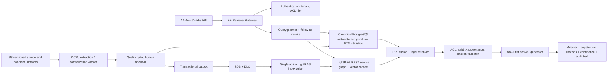

# Rencana Implementasi LightRAG untuk AA-Jurist

Status: Controlled regulation-corpus pilot implemented and benchmarked; shadow-only
Tanggal: 5 Agustus 2026
Keputusan: **GO untuk proof of concept; production hanya setelah seluruh quality, security, latency, dan cost gate terpenuhi.**

### Snapshot implementasi pilot

Pilot awal menggunakan tepat 58 kartu aturan yang saat ini dibaca aplikasi dan
LightRAG `1.5.5` yang dipin. Implementasi yang sudah tersedia meliputi:

- provider `baseline`, `shadow`, dan `lightrag` di Regulation Bot;
- timeout dan fallback sinkron ke baseline;
- pemetaan reference LightRAG ke ID record AA-Jurist secara exact tanpa
  pencocokan substring sitasi;
- LightRAG hanya menentukan ranking ID, sedangkan jawaban tetap disintesis dari
  record canonical AA-Jurist—raw graph chunks tidak langsung masuk prompt;
- fallback paksa jika ada aturan database yang belum termasuk manifest indeks
  pilot;
- exporter 58 dokumen dan manifest berisi hash corpus, hash payload indeks,
  canonical key, source record ID, provenance, serta content hash;
- gold set 35 query dan evaluator retrieval untuk exact lookup, single-hop,
  multi-hop, bilingual, serta pertanyaan di luar corpus;
- regression tests untuk provider/fallback, kontrak REST, canonical PMK lama,
  dan relasi heuristik.

Hasil benchmark aktual dicatat terpisah agar rencana arsitektur ini tidak
tercampur dengan angka eksperimen yang dapat berubah setiap kali corpus,
ontology, model, atau konfigurasi retrieval berubah.

Hasil pilot 58 kartu/35 query menunjukkan LightRAG `mix` meningkatkan required
recall@5 dari 90,63% menjadi 92,19%, exact lookup top-1 dari 83,33% menjadi
100%, dan multi-hop all-required@5 dari 60% menjadi 80%. Namun `naive`
memberikan hasil yang praktis sama dengan latency lebih rendah, dan ketiga
engine tetap menghasilkan false positive pada seluruh query di luar corpus.
Artinya, manfaat vector retrieval terlihat, tetapi manfaat graph belum terbukti
pada corpus ringkasan kecil ini. Keputusan pilot adalah **GO untuk shadow dan
eksperimen full-text terkurasi; NO-GO untuk aktivasi produksi saat ini**. Detail
dan raw results ada di `tests/evaluation/results/`.

## 1. Ringkasan keputusan

LightRAG layak digunakan untuk memperdalam pencarian dan analisis hubungan antara putusan, pasal, isu sengketa, bukti, argumentasi, pertimbangan majelis, outcome, serta perubahan regulasi.

Implementasi yang disarankan bukan mengganti seluruh RAG AA-Jurist. LightRAG ditempatkan sebagai **graph-enhanced retrieval sidecar** di belakang retrieval gateway AA-Jurist. PostgreSQL canonical tetap menjadi sumber kebenaran untuk metadata, status berlaku aturan, temporal versioning, hak akses, statistik, serta pemetaan kutipan sampai halaman dan paragraf.

Keputusan ini penting karena:

- RAG aktif masih memakai token-frequency cosine dan boost heuristik, bukan persisted embedding index.
- Endpoint smart chat memuat dokumen ke memori lalu melakukan ranking di aplikasi.
- Query putusan dibatasi `LIMIT 1000`, sehingga target 80.000 putusan tidak akan tercakup.
- Database online baru menyimpan metadata PDF dan extraction JSONB; belum ada raw/page text, legal chunks, embedding, atau passage-level provenance.
- Pencarian similar case masih memakai data mock, bukan seluruh database putusan.
- LightRAG tidak menyediakan first-class arbitrary metadata filtering yang cukup untuk filter legal seperti tahun, jenis pajak, panel, masa berlaku, outcome, dan tenant.
- Citation bawaan LightRAG belum otomatis menjadi legal-grade citation sampai halaman, paragraf, pasal, dan versi sumber.

LightRAG tidak boleh menjadi sumber kebenaran untuk:

- apakah suatu peraturan berlaku pada tanggal tertentu;
- angka, agregasi, atau statistik putusan;
- nomor, tanggal, status, dan metadata resmi;
- authorization dan tenant isolation;
- hasil ekstraksi yang belum lolos quality review;
- isi jawaban akhir tanpa validasi evidence dan citation AA-Jurist.

## 2. Kesesuaian LightRAG dengan kebutuhan AA-Jurist

LightRAG menggabungkan vector retrieval dengan knowledge graph. Saat indexing, sistem mengekstrak entity dan relation dari chunk; saat retrieval, sistem dapat mengambil fakta/entity lokal, tema dan relasi global, atau kombinasi graph dan text chunks.

Mode yang relevan:

| Mode | Penggunaan di AA-Jurist |
|---|---|
| `naive` | Vector retrieval atas potongan teks asli. |
| `local` | Putusan, pasal, objek koreksi, atau entity tertentu. |
| `global` | Pola dan relasi lintas banyak putusan atau regulasi. |
| `hybrid` | Gabungan entity lokal dan relasi global. |
| `mix` | Local + global + naive; kandidat utama untuk deep research setelah benchmark. |

LightRAG juga menyediakan incremental insertion, asynchronous indexing dan tracking, document deletion dengan pemutakhiran graph, reranking, citation/reference, custom KG, serta pemisahan model untuk tahap extraction, keyword, query, dan vision.

Namun hasil paper dan demo resmi tidak membuktikan kesiapan langsung untuk 80.000 putusan Indonesia. Karena itu, manfaatnya harus dibuktikan melalui benchmark lokal dan expert review.

## 3. Temuan audit AA-Jurist saat ini

### 3.1 Retrieval

- `lib/smart-chat.ts` melakukan document-level ranking menggunakan term-frequency cosine dan boost heuristik.
- `app/api/smart-chat/route.ts` mengambil seluruh kandidat dari `listDecisionDocuments()`.
- `lib/db.ts` membatasi daftar tersebut pada 1.000 putusan terbaru.
- Context LLM berupa metadata dan snippet ringkas, belum passage yang mempunyai page anchor.
- Regulation chat juga memuat daftar aturan dan menilainya di memori.
- Similar-case UI masih menggunakan `comparableDecisions` dari mock data.

### 3.2 Corpus dan ingestion

- Online PostgreSQL memiliki `decision_documents` dan `decision_extractions`, tetapi belum mempunyai page text dan chunks.
- PDF diproses sinkron dalam potongan halaman; hasil akhirnya berupa structured summary JSON.
- Re-extract menimpa extraction JSONB, tetapi belum menginvalidasi secondary indexes.
- Regulasi sudah mempunyai modal yang baik berupa canonical key, translation layer, extraction, status, dan relation JSON, tetapi belum mempunyai provision/chunk/vector index.
- Tidak ada queue, dead-letter queue, indexing worker, index release, migration framework, atau RAG evaluation harness.

### 3.3 Aset pilot yang tersedia

Prototype SQLite lokal menyimpan:

- 116 putusan;
- 10.807 decision chunks;
- 24 peraturan;
- 1.535 regulation chunks;
- 229 regulation links;
- 10.356 halaman, dengan 106 dokumen mempunyai full text.

Corpus ini dapat menjadi seed pilot setelah data-quality check. Rata-rata sampel mendekati 89 halaman dan 93 chunks per putusan. Bila sampel itu representatif, 80.000 putusan dapat berarti sekitar 7,1 juta halaman dan 7,4 juta chunks. Karena variasi dokumen besar, capacity planning harus memakai rentang **1,6–7,2 juta halaman**, bukan satu asumsi tetap.

## 4. Arsitektur target



### 4.1 Batas tanggung jawab

| Komponen | Tanggung jawab |
|---|---|
| Canonical PostgreSQL | Metadata resmi, full/page text, chunks, status/versi aturan, hash, language/master translation, ACL, index state. |
| Deterministic retrieval | Nomor putusan/pasal, date/status filter, FTS, trigram, aggregations, exact lookup. |
| LightRAG | Vector chunks, entity/relation retrieval, pola lintas dokumen, graph exploration. |
| Retrieval gateway | Query planning, tenant enforcement, provider routing, fusion, timeout, fallback, metering. |
| Citation validator | Memetakan reference ke document version, chunk, halaman/pasal, dan sumber resmi. |
| Answer generator | Menyusun jawaban dengan format AA-Jurist hanya dari context yang lolos gate. |

LightRAG tidak diekspos langsung ke browser. Next.js mengaksesnya melalui internal retrieval gateway.

## 5. Strategi corpus yang hemat

Jangan menjalankan entity/relation extraction berbasis LLM atas seluruh halaman mentah pada tahap awal. Gunakan tiering berikut.

### Tier A — graph penuh regulasi

Graph dibuat per instrumen, versi, dan pasal yang sudah dinormalisasi:

- nomor dan jenis peraturan;
- pasal/ayat;
- effective date dan end date;
- aturan yang diubah, dicabut, atau dilaksanakan;
- konsep dan jenis pajak;
- hubungan antarperaturan;
- putusan yang menerapkan atau menafsirkan pasal.

Relasi `AMENDS`, `REVOKES`, `IMPLEMENTS`, dan status berlaku tetap divalidasi dan disimpan secara deterministik di canonical database. Graph LightRAG hanya menjadi retrieval hint.

### Tier B — graph putusan terkurasi

Graph putusan hanya dibangun dari bagian bernilai tinggi yang telah dinormalisasi:

- metadata putusan;
- jenis pajak dan masa pajak;
- objek dan alasan koreksi;
- posisi DJP;
- posisi WP;
- bukti utama;
- dasar hukum;
- pertimbangan majelis;
- amar dan outcome.

Gunakan sekitar 2–6 canonical sections per putusan, bukan seluruh halaman mentah.

### Tier C — full-text vector dan lexical index

Full text seluruh putusan tetap tersedia untuk paragraph-aware BM25/FTS dan vector retrieval. LightRAG v1.5 menyediakan processing option `!` untuk melewati entity/relation extraction tetapi tetap menyimpan chunk vectors. Opsi ini harus diuji pada versi yang dipin sebelum dipakai untuk bulk ingestion.

### Tier D — on-demand graph expansion

Full graph extraction hanya dilakukan untuk:

- putusan yang sering diakses;
- putusan landmark;
- isu prioritas;
- dokumen yang lolos quality gate tinggi;
- corpus tambahan yang terbukti meningkatkan benchmark.

Strategi ini menahan biaya, durasi, dan noise graph tanpa kehilangan full-text search atas 80.000 putusan.

## 6. Ontology dan canonical ID

Entity harus menggunakan ID kanonik, bukan display name, untuk mencegah penggabungan keliru.

Contoh:

```text
DEC:PUT-011708.99-2024-PP-M.IIB
REG:UU-8-1983-PPN
REGVER:UU-8-1983@2021-10-29
ART:UU-8-1983-PPN:9(8)
ISSUE:PPN:INPUT-VAT-CREDIT
EVIDENCE:TAX-INVOICE
```

Entity awal:

- `Decision`
- `Regulation`
- `RegulationVersion`
- `Article`
- `TaxType`
- `TaxPeriod`
- `Issue`
- `CorrectionObject`
- `EvidenceType`
- `Argument`
- `CourtReasoning`
- `Outcome`
- `ProcedureStage`
- `AuthorityUnit`

Relasi awal:

- `CITES`
- `APPLIES`
- `INTERPRETS`
- `AMENDS`
- `REVOKES`
- `IMPLEMENTS`
- `EFFECTIVE_DURING`
- `DISPUTES`
- `SUPPORTS_ARGUMENT`
- `CONTRADICTS`
- `ACCEPTS_EVIDENCE`
- `REJECTS_EVIDENCE`
- `DECIDES`
- `SAME_ISSUE_AS`

Nama dan NPWP wajib diperlakukan sebagai data sensitif. Untuk shared public graph, prioritaskan nomor putusan dan entity legal; jangan menjadikan identitas privat sebagai hub graph.

## 7. Bahasa dan pencegahan dokumen ganda

- Bahasa Indonesia menjadi canonical master.
- “VAT Law” tidak dibuat sebagai sumber hukum baru bila hanya terjemahan “UU PPN”.
- Terjemahan menyimpan `master_version_id` dan `translation_version` yang mengarah ke sumber Indonesia yang sama.
- Query berbahasa Inggris memakai multilingual embedding dan query expansion.
- Jawaban Inggris disusun dari context canonical yang sama.
- Translation index terpisah hanya dibuat bila benchmark multilingual menunjukkan kebutuhan nyata.

## 8. Query routing dan fusion

| Pertanyaan | Jalur utama |
|---|---|
| Nomor putusan/peraturan tertentu | SQL/FTS exact lookup, lalu `local`/`naive` bila perlu. |
| Pasal yang berlaku pada periode tertentu | Temporal SQL filter wajib; semantic retrieval hanya setelah kandidat valid. |
| Putusan dengan fakta serupa | FTS/vector + LightRAG `local`/`hybrid`. |
| Pola pertimbangan lintas banyak putusan | LightRAG `mix`/`global`. |
| Hubungan bukti, argumentasi, dan outcome | `hybrid`/`mix` + reranker. |
| Jumlah, persentase, dan statistik | SQL aggregation, bukan LLM atau graph. |
| Follow-up percakapan | Query rewriter membuat standalone query sebelum retrieval. |
| Sumber tidak cukup | Refusal atau qualified answer. |

Kandidat dari deterministic retrieval dan LightRAG digabung memakai Reciprocal Rank Fusion. Reranker diterapkan pada kumpulan kandidat akhir. Semua kandidat yang gagal tenant, temporal, review-status, dan citation gate dibuang sebelum generation.

## 9. Data model minimum

### `legal_documents`

- `document_id`
- `canonical_key`
- `document_type`
- `jurisdiction`
- `official_source`
- `current_version_id`
- `visibility`
- `tenant_id` bila private

### `legal_document_versions`

- `version_id`
- `document_id`
- `source_sha256`
- `text_sha256`
- `source_url`
- `published_at`
- `effective_from`
- `effective_to`
- `legal_status`
- `language`
- `master_version_id`
- `ocr_version`
- `extraction_version`
- `schema_version`
- `prompt_version`
- `review_status`

### `legal_pages`

- `page_id`
- `version_id`
- `page_number`
- `text`
- `ocr_confidence`
- `image_artifact_url`
- `text_sha256`

### `legal_chunks`

- `chunk_id`
- `version_id`
- `section_type`
- `heading_path`
- `page_from`
- `page_to`
- `paragraph_from`
- `paragraph_to`
- `ordinal`
- `text`
- `text_sha256`
- `approved_for_rag`
- `sensitivity`

Gunakan deterministic ID:

```text
chunk_id = hash(version_id + section_path + ordinal + normalized_text)
```

### `rag_sync_jobs`

- `job_id`
- `document_id`
- `version_id`
- `operation`: `UPSERT`, `DELETE`, atau `REINDEX`
- `target_workspace`
- `content_sha256`
- `status`
- `attempt_count`
- `last_error`
- `created_at`, `started_at`, `completed_at`

### `rag_index_releases`

- `index_release_id`
- `workspace`
- `corpus_snapshot_id`
- `lightrag_release` dan `image_digest`
- `embedding_model` dan `embedding_dimension`
- `chunk_config_hash`
- `entity_prompt_version`
- `extract_model`, `keyword_model`, `query_model`
- `reranker_model`
- `source_manifest_sha256`
- `status`

## 10. Ingestion dan sinkronisasi

```text
Source PDF
  -> checksum + duplicate/canonical check
  -> page-aware extraction/OCR
  -> normalization + section detection
  -> data-quality validation
  -> human/automatic approval gate
  -> immutable canonical version
  -> transactional outbox
  -> SQS job
  -> idempotent index writer
  -> LightRAG track/status polling
  -> citation mapping validation
  -> mark index release ready
```

Ketentuan operasional:

- Hanya satu active indexing writer per workspace.
- Query service dan ingestion worker dipisah agar indexing tidak memblokir chat.
- Setiap upsert memakai stable document ID dan content hash.
- Re-extract yang mengubah content membuat immutable version baru dan index event baru.
- Delete source mengirim delete event; jangan menghapus langsung tanpa audit manifest.
- Gagal berulang masuk DLQ dan membutuhkan triage.
- Parser, chunker, prompt, model, dan schema version selalu direkam.
- Perubahan besar embedding, chunking, storage, atau ontology membuat green workspace baru; tidak memutasi production index in-place.

## 11. Integrasi aplikasi

Gunakan provider interface agar UI dan answer generator tidak terikat pada LightRAG:

```ts
interface RagProvider {
  retrieve(query: RetrievalQuery): Promise<RetrievedContext[]>;
}
```

Provider awal:

- `LegacyRagProvider`
- `DeterministicRagProvider`
- `LightRagProvider`
- `FusionRagProvider`

Feature flags:

```text
RAG_PROVIDER=legacy | deterministic | lightrag | fusion
RAG_SHADOW_MODE=true | false
RAG_INDEX_RELEASE=<release-id>
```

Retrieval response internal minimal:

```json
{
  "passageId": "...",
  "documentId": "...",
  "versionId": "...",
  "sourceType": "decision",
  "title": "...",
  "citation": "...",
  "pageFrom": 12,
  "pageTo": 13,
  "section": "court_reasoning",
  "text": "...",
  "score": 0.91,
  "retriever": "lightrag_mix",
  "workspace": "decisions_public_blue",
  "indexReleaseId": "..."
}
```

Answer generator hanya menerima passage yang berhasil dipetakan kembali ke canonical database.

## 12. Deployment AWS

### Pilot hemat

- Next.js/Vercel dapat tetap berjalan untuk UI.
- S3 versioning untuk source PDF dan canonical artifacts.
- SQS + DLQ untuk indexing jobs.
- ECS Fargate untuk internal LightRAG REST/query service.
- ECS task atau AWS Batch worker untuk indexing/backfill.
- RDS PostgreSQL terpisah untuk storage LightRAG.
- Secrets Manager, KMS, CloudWatch, dan private networking.
- Internal ALB; LightRAG tidak mempunyai public route.

Konfigurasi storage awal yang disarankan untuk versi LightRAG terkini:

```text
LIGHTRAG_KV_STORAGE=PGKVStorage
LIGHTRAG_VECTOR_STORAGE=PGVectorStorage
LIGHTRAG_GRAPH_STORAGE=PGTableGraphStorage
LIGHTRAG_DOC_STATUS_STORAGE=PGDocStatusStorage
```

Pilihan ini memakai stock PostgreSQL dan pgvector sehingga pilot tidak langsung menambah Neo4j, Qdrant, Redis, dan OpenSearch. Gunakan database/schema terpisah dari transaksi AA-Jurist agar indexing dan autovacuum tidak mengganggu aplikasi.

Benchmark Neo4j atau vector store khusus hanya bila profil nyata menunjukkan bottleneck, misalnya retrieval p95, CPU, IOPS, autovacuum, ukuran index, atau ingestion throughput tidak memenuhi gate.

### Model strategy

- `EXTRACT`: model cepat, non-reasoning, dan terukur karena dipanggil pada banyak chunk.
- `KEYWORD`: model cepat dan latency-sensitive.
- `QUERY`: model lebih kuat untuk menyusun jawaban dari context panjang/noisy.
- Embedding: multilingual; model dan dimensinya dibekukan sebelum indexing production.
- Reranker: multilingual/legal-domain bila tersedia; diuji terhadap baseline umum.

Semua release, commit, dependency, model, dan container image wajib dipin. Jangan deploy langsung dari `main` atau tag `latest`.

## 13. Keamanan dan multitenancy

Workspace LightRAG menyediakan logical data isolation, tetapi bukan pengganti authorization boundary AA-Jurist. Built-in account system LightRAG juga bukan RBAC enterprise lengkap.

Kontrol wajib:

- LightRAG hanya dapat dipanggil retrieval gateway.
- User tidak boleh mengirim atau memilih nama workspace secara langsung.
- Gateway memetakan tenant dan allowed corpus dari authenticated session.
- ACL diperiksa sebelum retrieval dan divalidasi ulang pada setiap reference hasil retrieval.
- Public decisions/regulations tidak dicampur dengan dokumen private client.
- Dokumen private menggunakan workspace/instance terpisah atau private-RAG path sampai isolation teruji.
- WebUI LightRAG tidak dipublikasikan.
- API key/JWT internal dirotasi; default unauthenticated access dinonaktifkan.
- Request size, rate limit, egress, prompt injection, dan audit logging dikontrol.
- Log tidak menyimpan NPWP atau isi dokumen private secara terbuka.
- Cross-tenant red-team test menjadi hard production gate.

## 14. Benchmark dan UAT

### 14.1 Gold set

Siapkan minimal 300 pertanyaan ahli pajak untuk pilot, lalu perluas menjadi 400–600 sebelum production:

- 20% exact citation/known item;
- 25% similar case;
- 20% multi-hop putusan–regulasi;
- 15% argument versus counterargument;
- 10% unsupported/refusal;
- 10% bilingual.

Tambahkan kasus adversarial:

- pasal berubah pada periode berbeda;
- aturan dicabut atau diganti;
- nomor putusan sangat mirip;
- putusan bertentangan;
- OCR buruk;
- duplicate source;
- prompt injection di PDF;
- private-document leakage;
- pertanyaan yang membutuhkan penolakan.

### 14.2 Sistem pembanding

Bandingkan secara blind:

1. retrieval AA-Jurist saat ini;
2. PostgreSQL FTS/trigram;
3. FTS + pgvector;
4. LightRAG;
5. deterministic + LightRAG + RRF + reranker.

### 14.3 Production gates

| Ukuran | Gate awal |
|---|---:|
| Known-item Recall@10 | minimal 98% |
| Passage Recall@10 | minimal 90% |
| Citation precision | minimal 98% |
| Citation coverage | minimal 95% |
| Ketepatan versi aturan | minimal 99% |
| Penolakan pertanyaan unsupported | minimal 95% |
| Critical unsupported legal claims | maksimal 1%, target 0% |
| Entity collision | kurang dari 0,5% |
| Cross-tenant leakage | 0 |
| Retrieval p95 | di bawah 3 detik |
| End-to-end p95 exact/local | di bawah 8 detik |
| End-to-end p95 mix/global | di bawah 15 detik |
| Index freshness setelah approval | maksimal 24 jam |

LightRAG harus meningkatkan Recall@20 untuk pertanyaan relational/multi-document minimal 10 poin terhadap baseline, atau menghasilkan kualitas setara dengan biaya/latency yang lebih baik. Keputusan akhir tetap expert review, bukan LLM-as-judge saja.

### 14.4 UAT

1. Data dan engineering UAT.
2. Tax lawyer/advisor blind review.
3. Pilot users menggunakan perkara dengan jawaban yang sudah diketahui.

## 15. Roadmap implementasi

| Fase | Durasi | Scope dan deliverable | Exit criteria |
|---|---:|---|---|
| 0. Design freeze | 2 minggu | Data contract, ontology, canonical ID, security design, gold set, baseline. | Schema dan evaluation plan disetujui. |
| 1. Foundation | 2–3 minggu | Migration framework, legal page/chunk tables, outbox, queue, citation contract, provider interface. | Reproducible ingestion satu dokumen dan delete/re-extract sync. |
| 2. LightRAG PoC | 3 minggu | Pinned LightRAG, PostgreSQL storage, 1.000–2.000 putusan stratified + semua aturan aktif/representatif. | Mode query dan index cost terukur; tidak ada blocker data integrity. |
| 3. Quality pilot | 3–4 minggu | 10.000 putusan, RRF, reranker, temporal/citation gate, graph QA, UAT tahap 1–2. | Quality gates pilot terpenuhi. |
| 4. Scale build | 4–6 minggu | 80.000 putusan vector-all + curated graph, backfill orchestration, load/cost/security/DR test. | Throughput, ceiling biaya, recovery, dan freshness terpenuhi. |
| 5. Shadow/canary | 3 minggu | Shadow traffic, internal only, canary 10% → 25% → 50% → 100%. | Tidak ada regression kritis selama observation window. |
| 6. Hypercare | 2 minggu | Monitoring, incident rehearsal, tuning, runbook, ownership handoff. | SLO dan operational ownership disetujui. |

Total kalender realistis: **16–22 minggu bila foundation, evaluasi, dan persiapan scale berjalan sebagian paralel**; bila seluruh fase dijalankan berurutan, sekitar **19–23 minggu**. Durasi tetap bergantung pada kualitas OCR, tingkat manual review, dan throughput indexing. Timeline tidak boleh mengasumsikan seluruh 80.000 dokumen siap graph-index sejak hari pertama.

### Pilot dataset

- 1.000–2.000 putusan yang distratifikasi berdasarkan tahun, jenis pajak, outcome, panjang, dan kualitas OCR;
- seluruh regulasi aktif prioritas serta sampel regulasi historis/amendment;
- corpus SQLite legacy sebagai seed engineering test;
- minimal 300 expert questions dan 50 adversarial cases.

## 16. Cost-control gates

Biaya terbesar bukan lisensi LightRAG karena lisensinya MIT; komponen terbesar adalah parsing/OCR, LLM entity-relation extraction, embedding, reranking, database/IOPS, serta engineering QA.

Kontrol wajib:

- Ukur token dan waktu per halaman, per chunk, dan per dokumen pada pilot.
- Pisahkan `index_cost_per_document` dan `query_cost_per_answer`.
- Tetapkan monthly ceiling dan auto-pause backfill ketika 80% ceiling tercapai.
- Graph hanya canonical sections; full text vector-only secara default.
- Cache extraction yang mahal dan simpan content hash untuk idempotency.
- Batch embedding dan atur concurrency sesuai quota/provider.
- Gunakan spot/batch compute untuk backfill jika aman; query API tetap stabil.
- Jangan membeli/menjalankan Neo4j, OpenSearch, Redis, dan vector DB khusus sekaligus sebelum benchmark.
- Lakukan re-estimasi total 80.000 dokumen setelah minimal 1.000 putusan representatif selesai.

Rumus ceiling backfill:

```text
Projected full-corpus indexing cost
  = p95(index cost per representative document) × 80,000
    + 20% retry/reprocessing reserve
    + 15% exchange-rate/vendor-price reserve
```

Production scale hanya dilanjutkan bila proyeksi tersebut berada di bawah ceiling anggaran yang disetujui.

## 17. Rollout dan rollback

### Rollout

1. `legacy` tetap tampil; `fusion` berjalan shadow dan hasilnya disimpan untuk evaluasi.
2. Internal reviewer menggunakan `fusion`.
3. Canary 10%.
4. Naik ke 25%, 50%, lalu 100% setelah observation window dan gate terpenuhi.
5. Exact/statistical queries tetap boleh selalu memakai deterministic-only path.

### Automatic fallback

Fallback ke deterministic/legacy bila:

- LightRAG timeout atau unhealthy;
- reference kosong;
- reference gagal dipetakan ke canonical chunk;
- source tidak sesuai tenant/ACL;
- versi aturan tidak valid untuk tanggal pertanyaan;
- citation/confidence gate gagal.

### Blue-green index

```text
decisions_public_blue  <-> decisions_public_green
regulations_public_blue <-> regulations_public_green
```

Green index dibangun dari immutable source manifest, diuji, lalu pointer dipindahkan. Blue dipertahankan sedikitnya 30 hari. Embedding/model dimension, chunking besar, storage backend, atau ontology utama tidak diubah in-place.

## 18. Risiko dan mitigasi

| Risiko | Dampak | Mitigasi |
|---|---|---|
| Graph extraction mahal | Cost/time melebihi ceiling | Tiered corpus, vector-only full text, graph canonical sections, staged backfill. |
| Entity salah merge | Relasi hukum salah | Canonical IDs, controlled ontology, collision audit, curated regulation relations. |
| Citation tidak presisi | Jawaban hukum tidak dapat diverifikasi | Passage/page/article contract dan canonical citation resolver. |
| Aturan kedaluwarsa dipakai | Advice salah secara temporal | Deterministic version engine dan temporal gate. |
| Metadata filter lemah di LightRAG | Hasil tak sesuai jenis pajak/tahun | Filter dan exact lookup tetap di canonical SQL/search. |
| Tenant leakage | Insiden keamanan kritis | Gateway ACL, separate private corpus/workspace, post-retrieval validation, red-team test. |
| Stale index setelah re-extract/delete | Context lama tetap muncul | Immutable versions, transactional outbox, idempotent sync, manifest reconciliation. |
| Embedding/storage berubah | Reindex besar | Pin configuration dan blue-green workspace. |
| Indexing mengganggu query | Latency/availability turun | Separate DB/workload, queue, one writer, controlled concurrency. |
| Dependency berubah cepat | Regression | Pin release+commit+digest, internal mirror, contract tests, security review. |
| LightRAG tidak mengungguli baseline | Kompleksitas tanpa manfaat | Go/no-go benchmark; batasi LightRAG ke regulasi/graph exploration bila perlu. |

## 19. Definition of done produksi

Implementasi dinyatakan selesai hanya bila:

- seluruh hard quality dan security gate terpenuhi;
- semua jawaban dapat diaudit sampai passage, halaman/pasal, version ID, dan source URL;
- status berlaku aturan diverifikasi deterministik;
- tidak ada cross-tenant leakage;
- delete, re-extract, retry, DLQ, backup, restore, blue-green rebuild, dan rollback teruji;
- index dapat direproduksi dari immutable source manifest;
- cost per document dan cost per query berada dalam ceiling;
- legacy/deterministic fallback tetap operasional;
- runbook, dashboard, alert, incident owner, dan data owner tersedia;
- tax/legal SME menyetujui UAT akhir.

## 20. Langkah pertama yang direkomendasikan

Sprint pertama tidak langsung memasang LightRAG pada chatbot produksi. Urutannya:

1. Bekukan data contract, ontology, dan citation format.
2. Hilangkan pola retrieval `LIMIT 1000` sebagai sumber kandidat chat dan buat provider interface.
3. Tambahkan canonical page/chunk/version tables dan migration framework.
4. Migrasikan corpus SQLite legacy ke staging untuk pilot.
5. Bangun 300-question gold set dan ukur baseline saat ini.
6. Deploy LightRAG terisolasi dengan release/container digest yang dipin.
7. Ingest 1.000–2.000 dokumen representatif.
8. Jalankan benchmark sebelum memutuskan graph scope dan biaya full corpus.

## 21. Sumber utama

- [LightRAG repository dan README](https://github.com/HKUDS/LightRAG)
- [LightRAG paper](https://arxiv.org/abs/2410.05779)
- [LightRAG API Server documentation](https://github.com/HKUDS/LightRAG/blob/main/docs/LightRAG-API-Server.md)
- [LightRAG Core programming documentation](https://github.com/HKUDS/LightRAG/blob/main/docs/ProgramingWithCore.md)
- [LightRAG license](https://github.com/HKUDS/LightRAG/blob/main/LICENSE)
- [LightRAG releases](https://github.com/HKUDS/LightRAG/releases)
- [Amazon RDS PostgreSQL extension versions](https://docs.aws.amazon.com/AmazonRDS/latest/PostgreSQLReleaseNotes/postgresql-extensions.html)

## 22. Final go/no-go rule

**GO produksi** hanya bila fusion retrieval terbukti unggul pada pertanyaan similar-case dan multi-hop, citation/temporal/tenant gates terpenuhi, serta projected full-corpus cost berada di bawah ceiling.

**NO-GO untuk full production** bila LightRAG tidak memberi peningkatan material atas PostgreSQL FTS + pgvector + reranker, graph menambah noise, citation tidak mencapai gate, atau indexing seluruh corpus tidak ekonomis. Dalam kondisi itu, LightRAG tetap dapat dipakai terbatas untuk graph regulasi, curated landmark decisions, dan knowledge exploration.
