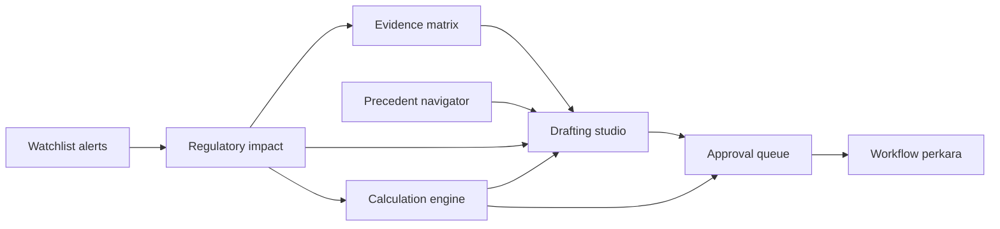

# Gelombang 4 — Diferensiasi AA Jurist

Tanggal verifikasi: 21 Agustus 2026
Status: implementasi lokal selesai; production hardening dan perluasan corpus tetap bertahap.

## Outcome

Gelombang 4 tersedia sebagai satu **Dispute Workbench** pada `/workbench`. Seluruh artefak dibatasi oleh `tenantId + clientId + matterId`, user selalu berasal dari signed session, dan perubahan dicatat ke audit trail lokal atomik.



## 1. Evidence matrix

- Struktur isu, proposisi yang harus dibuktikan, pihak yang menanggung beban, prioritas, status bukti, gap, sumber hukum, locator, resource ID, URL, dan SHA-256.
- Status `missing`, `collected`, `verified`, dan `contradicted` terlihat terpisah.
- Draf mengambil sumber dan gap langsung dari matrix; sumber kosong tidak disamarkan.

## 2. Precedent navigator

- Menjelaskan kemiripan, pembeda, shared terms, implikasi argumentasi, outcome, dan persentase similarity.
- Preseden dapat diperlakukan sebagai `support`, `distinguish`, atau `risk`.
- Distribusi outcome hanya deskriptif. UI dan API menyatakan tegas bahwa similarity bukan prediksi kemenangan.
- Pilot memakai comparator lokal citation-ready. Migrasi berikutnya adalah seluruh corpus putusan 80 ribu dengan page locator dan source hash.

## 3. Drafting studio

- Template: legal memo, keberatan, banding, tanggapan, dan peninjauan kembali.
- Draf mengikat evidence IDs, precedent IDs, calculation IDs, dasar hukum, locator, source hash, gap, risiko, versi, dan fingerprint sumber.
- Status `draft → in_review → approved/rejected` terhubung ke approval queue.
- Konten tetap berlabel draf kerja dan tidak dianggap advisor-ready tanpa review.

## 4. Explainable calculation engine

- PPN nilai lain `tarif × faktor × nilai transaksi`.
- PPN tarif penuh.
- Pemotongan atas nilai bruto.
- Gross-up dari nilai neto.
- Setiap kalkulasi menyimpan input, langkah, formula, hasil, tanggal basis, dasar hukum, asumsi, status review, dan SHA-256 fingerprint.
- Engine menghitung skenario; klasifikasi objek, fasilitas, transisi, dan ketentuan khusus tetap harus divalidasi.

## 5. Regulatory impact monitor

- Alert watchlist dipetakan ke evidence, draf, dan kalkulasi matter dengan keterkaitan istilah/sitasi.
- Status impact: `new`, `assessing`, `actioned`, `not_applicable`.
- Alert kritis mendapat target tindak lanjut tiga hari.
- Sumber perubahan tetap berasal dari watchlist dan graph yang telah direview.

## 6. Workflow perkara dan approval

- Tahap: intake, pemeriksaan, keberatan, banding, persidangan, PK, dan closed.
- Risk rating, next deadline, task, assignee, status, dan artefak terhubung.
- Pemohon dapat mengajukan approval; hanya owner/admin workspace atau matter lead yang dapat approve/reject.
- Keputusan approval memperbarui status draf atau kalkulasi secara atomik dan masuk audit trail.

## Benchmark

Artefak: `tests/evaluation/results/wave4-differentiation.json`

| Domain | Kasus | Hasil |
|---|---:|---:|
| Kalkulasi | 24 | exact 100% |
| Preseden | 7 | Hit@3 100% |
| Evidence contract | 10 | 100% |
| Draft grounding | 8 | 100% |
| Impact linking | 4 | 100% |
| Workflow contract | 5 | 100% |
| **Total** | **58** | seluruh gate lulus |

Unit test terpisah memverifikasi kalkulasi, grounding draf, no-prediction guard, impact mapping, isolasi tenant/matter, dan otorisasi approval.

## Batas yang tidak disamarkan

1. Preseden pilot masih memakai comparator lokal. Kualitas production memerlukan seluruh putusan memiliki PDF, hash, halaman, fakta, reasoning, dan outcome yang direview.
2. Engine kalkulasi belum menjadi rule engine lengkap seluruh jenis pajak. Formula dikontrol user dan harus dihubungkan ke versioned tax-rule registry.
3. Draft generator saat ini deterministik dan source-grounded. Model generatif dapat ditambahkan setelah claim-level citation validation stabil.
4. Impact monitor hanya sebaik kualitas update watchlist dan verified legal graph.
5. Penyimpanan Gelombang 4 sengaja local-first. Deployment multi-instance memerlukan repository Postgres, row-level tenant enforcement, backup, dan migration.

## Perintah verifikasi

```bash
npm run test:wave4
npm run eval:wave4
npm run lint
npm run build
```
